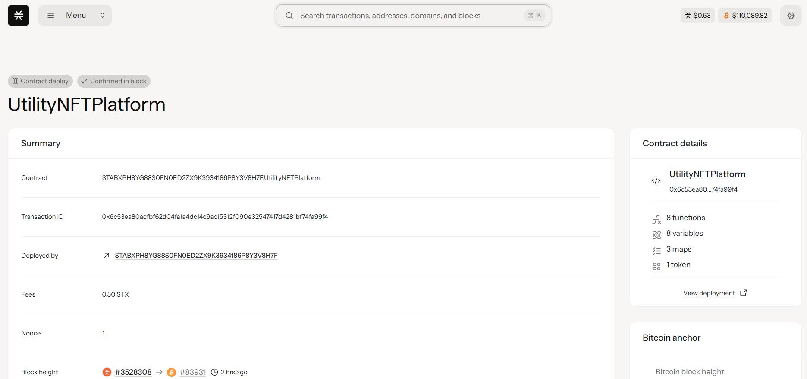

# UtilityNFT Platform

## Project Description

The UtilityNFT Platform is a revolutionary blockchain-based system that transforms traditional NFTs into powerful utility tokens with real-world applications. Unlike conventional NFTs that serve primarily as digital collectibles, our platform creates NFTs that provide tangible benefits including membership access, voting rights, and exclusive privileges.

Each UtilityNFT acts as a digital key that unlocks multiple layers of functionality:
- **Membership Access**: Different tier levels (Bronze, Silver, Gold, Platinum) with varying access rights
- **Voting Rights**: Democratic participation in platform governance with weighted voting power
- **Exclusive Benefits**: Access to premium features, events, and community perks
- **Time-bound Privileges**: Membership access with configurable expiry periods

## Project Vision

Our vision is to bridge the gap between digital ownership and practical utility, creating a new paradigm where NFTs serve as multi-functional digital assets. We aim to:

1. **Democratize Access**: Provide fair and transparent membership systems through blockchain technology
2. **Enable True Ownership**: Give users complete control over their digital identities and access rights
3. **Foster Community Governance**: Empower NFT holders to participate in decision-making processes
4. **Create Sustainable Value**: Build long-term utility that extends beyond speculative trading
5. **Establish Standards**: Set new benchmarks for utility-driven NFT implementations

The platform envisions a future where every NFT is not just a piece of digital art, but a functional tool that provides ongoing value to its holder through real-world applications and community participation.

## Future Scope

### Phase 1: Foundation Enhancement
- Integration with multiple blockchain networks for cross-chain compatibility
- Advanced metadata management system with IPFS integration
- Enhanced voting mechanisms with proposal creation and management

### Phase 2: Ecosystem Expansion
- **Marketplace Integration**: Native trading platform for UtilityNFTs
- **Staking Mechanisms**: Reward systems for long-term NFT holders
- **Partnership Network**: Integration with real-world businesses for exclusive benefits
- **Mobile Application**: User-friendly mobile interface for managing NFT utilities

### Phase 3: Advanced Features
- **AI-Powered Recommendations**: Personalized benefit suggestions based on user behavior
- **Dynamic Utility Upgrades**: Evolving NFT capabilities based on holder engagement
- **Cross-Platform Benefits**: Integration with gaming, e-commerce, and social platforms
- **DAO Integration**: Full decentralized autonomous organization features

### Phase 4: Enterprise Solutions
- **Corporate Membership Systems**: Enterprise-grade access management
- **Event Management Integration**: Seamless integration with ticketing and event platforms
- **Loyalty Program Framework**: White-label solutions for businesses
- **Analytics Dashboard**: Comprehensive insights for platform optimization

### Long-term Vision
- Global adoption as the standard for utility-driven NFTs
- Integration with IoT devices for smart contract-enabled physical access
- Expansion into virtual reality and metaverse applications
- Development of industry-specific utility templates

## Contract Address Details
contract ID:STABXPH8YG88S0FN0ED2ZX9K3934186P8Y3V8H7F.UtilityNFTPlatform

**Testnet Deployment:**
- Contract Address: STABXPH8YG88S0FN0ED2ZX9K3934186P8Y3V8H7F.UtilityNFTPlatform
- Transaction Hash: 0x6c53ea80acfbf62d04fa1a4dc14c9ac15312f090e32547417d4281bf74fa99f4
- Block Height: 0x057360ee30fe6f58577f5dd90252b93a91427413e87a6adcdf30b9556b3a05dd

**Network Information:**
- Blockchain: Stacks Blockchain
- Language: Clarity Smart Contracts
- Standard: Custom UtilityNFT Implementation

---

## Smart Contract Features

### Core Functions

1. **mint-utility-nft**: Creates new NFTs with embedded utility features including membership tiers, voting power, and access levels
2. **cast-vote**: Enables NFT holders to participate in governance voting using their NFT's voting power

### Key Capabilities

- **Membership Management**: Tiered access system with configurable expiry
- **Voting System**: Democratic governance with weighted voting based on NFT attributes
- **Metadata Storage**: Comprehensive NFT information including utility features
- **Owner Verification**: Secure access control ensuring only NFT owners can utilize benefits
- **Event Tracking**: Transparent logging of all voting and utility usage

### Security Features

- Owner-only minting to prevent unauthorized NFT creation
- Double-voting prevention for fair governance
- Secure ownership verification for all utility functions
- Comprehensive error handling and validation

---

